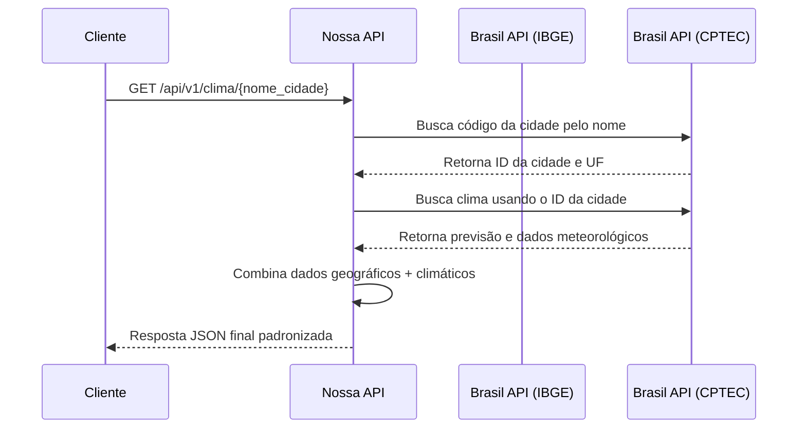

# 🌦️ API de Agregação de Dados Climáticos e Geográficos


> **Projeto Acadêmico:** Atividade avaliativa desenvolvida para a disciplina de **Técnicas de Integração de Sistemas (N703)**.

Esta é uma API RESTful desenvolvida em **Python** utilizando **FastAPI** para a agregação de dados climáticos e geográficos. O objetivo do projeto é fornecer endpoints unificados que processam dinamicamente informações de localidades (buscando apenas pelo nome da cidade) e combinam dados do IBGE com métricas climáticas do CPTEC/INPE (através da Brasil API).

---

## ✨ Funcionalidades

- **Busca Integrada:** Informando apenas o nome da cidade, a API busca seu código geográfico e consome os dados climáticos sem o uso de coordenadas fixas.
- **Listagem de Municípios:** Consulta paginada de todas as cidades de um estado específico através de sua sigla (UF).
- **Tratamento Robusto de Erros:** Respostas padronizadas para cidades/estados não encontrados (404), parâmetros inválidos (400) e falha de serviços de terceiros (503).
- **Monitoramento:** Endpoint de *Health Check* para garantir a disponibilidade do serviço interno e da comunicação com APIs externas.

---

## 🔄 Fluxo de Integração

Abaixo está a representação da arquitetura e do fluxo de chamadas feito pela aplicação:



---

## 🚀 Instalação e Execução

### Pré-requisitos
- **Python 3.9** ou superior
- **Git** para clonagem do repositório

### Passo a Passo

1. **Clone este repositório:**
   ```bash
   git clone <link-do-repositorio>
   cd Integracao_sistema
   ```

2. **Instale as dependências:**
   ```bash
   pip install -r requirements.txt
   ```

3. **Inicie o servidor localmente:**
   > A aplicação está configurada para rodar **obrigatoriamente na porta 3000**, conforme os requisitos do projeto.
   ```bash
   uvicorn src.main:app --host 0.0.0.0 --port 3000 --reload
   ```

4. **Acesse a Documentação Interativa:**
   A API conta com documentação baseada no padrão OpenAPI (Swagger UI).
   - 👉 **Swagger UI:** [http://localhost:3000/docs](http://localhost:3000/docs)

---

## 📡 Endpoints Disponíveis

A API possui as seguintes rotas base (Prefixo: `/api/v1`):

| Método | Endpoint | Descrição |
|--------|----------|-----------|
| `GET` | `/health` | Verifica a saúde da API e conectividade com serviços externos. |
| `GET` | `/clima/{nome_cidade}` | Retorna dados geográficos e climáticos da cidade solicitada. |
| `GET` | `/cidades/{sigla_uf}` | Lista municípios de um estado. Suporta o query parameter `?limite=N` (padrão 10). |

> **Postman:** Uma collection completa do Postman com cenários de sucesso e erro está disponível na pasta `docs/postman_collection.json` para facilitar a validação.

---

## 🧪 Testes Automatizados

O projeto utiliza o framework `pytest` para testes de integração, cobrindo cenários de validações e os retornos de erro padronizados. Para executar a suíte de testes na raiz do repositório:

```bash
# No Windows (PowerShell):
$env:PYTHONPATH="."; pytest tests/

# No Linux/Mac:
PYTHONPATH=. pytest tests/
```

---

## 👥 Equipe Desenvolvedora

Para mais informações sobre os integrantes envolvidos neste projeto, papéis (Desenvolvimento Backend, Integração, Qualidade, Documentação) e respectivas matrículas, acesse o documento [INTEGRANTES.md](INTEGRANTES.md).
